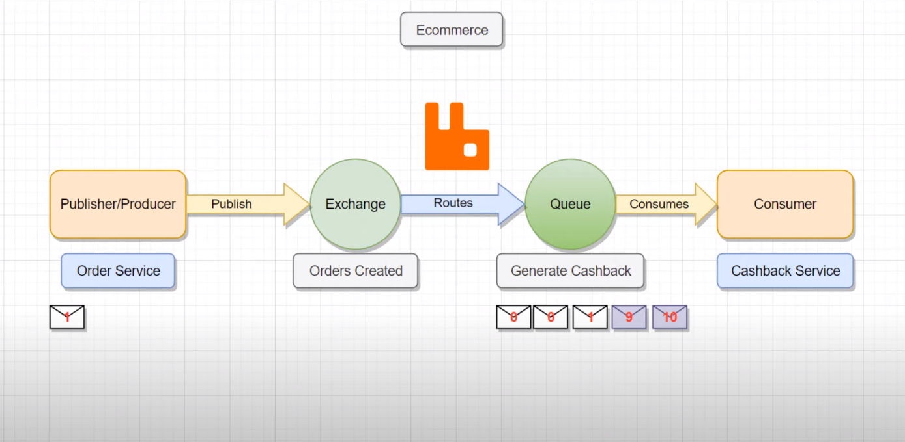
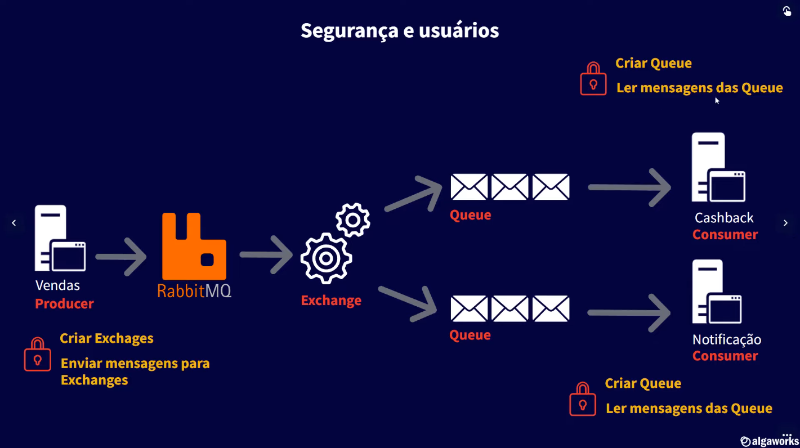

# Mensageria com Spring AMQP

**Aplicação desenvolvida no canal da Algaworks no [vídeo](https://www.youtube.com/watch?v=SzcvuHjRJKE). Uma introdução ao RabbitMQ.**

Três aplicações Spring:
- **order-service** (Api - produtor)
- **cashback-service** (backend simples - consumidor)
- **notification-service** (backend simples - consumidor)

As três aplicações irão se comunicar via mensageria. A **order-service** irá atuar como produtor e as outras aplicações serão consumidores.

**Run MySQL and RabbitMQ**
```
docker-compose up
```

**RabbitMQ Management**:
```
http://localhost:15672
user: rabbitmq
pass: rabbitmq
```

**Mensageria**


**Dead-Letter Queue**

Fila que contém mensagens que falharam no processamento. Podemos ter também uma DLX (Dead Letter Exchange) ligada a uma DLQ.

Uma vez que a mensagem vai para a DLQ podemos utilizar um plugin no rabbitmq para repor essas mensagens na fila principal para novo processamento.
Além dos plugins também podemos utilizamos o reprocessamento programaticamente. Para este último caso devemos desativar a configuração no .yml referente ao reprocessamento(retry) automático
e fazer essa configuração do retry programaticamente com um Listener para o DLQ. 

Caso o reprocessamento das mensagens ainda gerem mensagens com erro e elas não puderem ser descartadas, podemos guardá-las em um banco de dados ou enviar essas mensagens para uma outra fila. Existe um conceito chamado ParkingLot que é uma fila que contém mensagens que já passaram pelo retry (as mensagens falharam no retry)
e não podem ser descartadas.

O retry nesse exemplo foi simulado na aplicação **cashback-service**. A DeadLetterQueueListener.java trata o **retry** programaticamente e o **ParkingLot**.


**Como priorizar o processamento de uma mensagem no RabbitMQ**

Uma mensagem que deve ser priorizada com relação as demais deve carregar uma informação de prioridade para que o rabbitmq reordene a fila de mensagens com relação a prioridade de cada mensagem. O produtor da mensagem é que aplica essa prioridade as mensagens.



**Como aumentar a segurança RabbitMQ com usuários e permissões**
Como boa prática de gerenciamento de criação de filas e exchanges é indicado controlar o acesso a criação de cada recurso.

Para nosso exemplo, com o container do rabbitmq rodando, vamos executar uns comando de criação de usuários dentro do container

```
docker exec -it [containerId] bash

# Cria usuário
rabbitmqctl add_user 'algaworks' '123'

# Fornecer permissão de acesso ao usuário criado
rabbitmqctl set_user_tags algaworks administrator

# Adicionando permissões ao usuário para criar, remover filas
rabbitmqctl set_permissions -p "/" "algaworks" ".*" ".*" ".*"

-> Os últimos três parâmetros do comando acima indicam as permissões: 
- A primeira permissão é sobre a criação de recursos, como filas e exchanges.
- A segunda permissão referencia a escrita nos recursos.
- A terceira permissão referencia a leitura de mensagens nos recursos.

-> Deixando as permissões somente  o usuário 'algaworks'
rabbitmqctl set_permissions -p "/" "algaworks" "^algaworks.*" "^algaworks.*|^amq.default$" "^algaworks.*" 

# Lista usuário
rabbitmqctl list_users

# Remover usuário
rabbitmqctl delete_user 'teste'

```

Para a aplicação de exemplo vamos utilizar as configurações abaixo no rabbitmq. Antes de executar a aplicação não esqueça de alterar os arquivos **.yml** de cada projeto com a senha e password de cada serviço.
```
ORDER SERVICE

rabbitmqctl add_user 'order-service' '123'
rabbitmqctl set_permissions -p "/" "order-service" "^orders\.v1\..*" "^orders\.v1\..*" ""

-> A aplicação order-service vai precisar criar as exchanges e publicar mensagens.
```
```
CASHBACK SERVICE

rabbitmqctl add_user 'cashback-service' '123'
rabbitmqctl set_permissions -p "/" "cashback-service" ".*generate-cashback*|^orders.v1.order-created$|^orders.v1.order-created.dlx$" ".*generate-cashback*|^orders.v1.order-created.dlx$" ".*generate-cashback*|^orders.v1.order-created$|^orders.v1.order-created.dlx$"

-> A aplicação cahsback-service vai precisar criar as filas e a exchange da dlx e consumir mensagens.
```
```
NOTIFICATION SERVICE

rabbitmqctl add_user 'notification-service' '123'
rabbitmqctl set_permissions -p "/" "notification-service" ".*send-notification$" ".*send-notification$" ".*send-notification$|^orders.v1.order-created$"

-> A aplicação notification-service vai precisar criar as filas e consumir mensagens.
```


