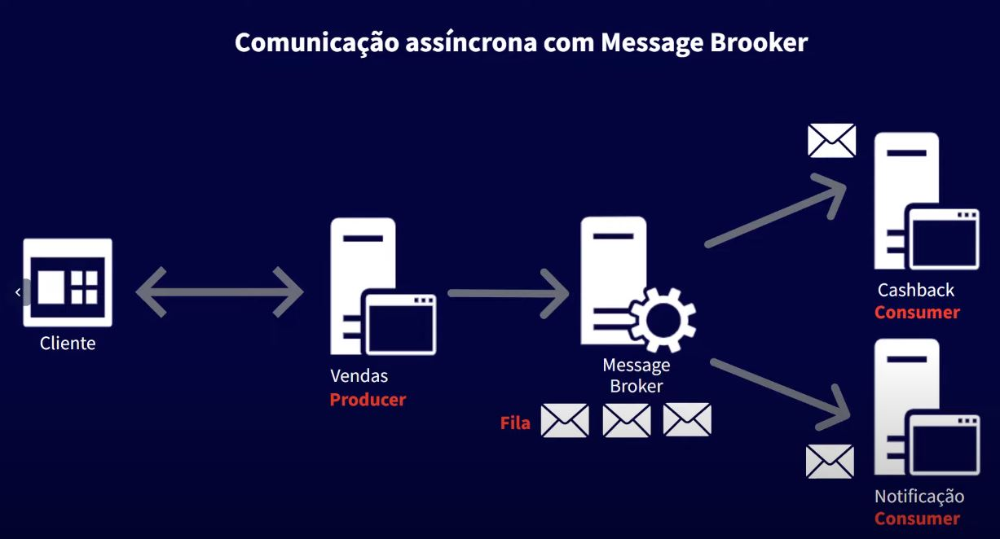
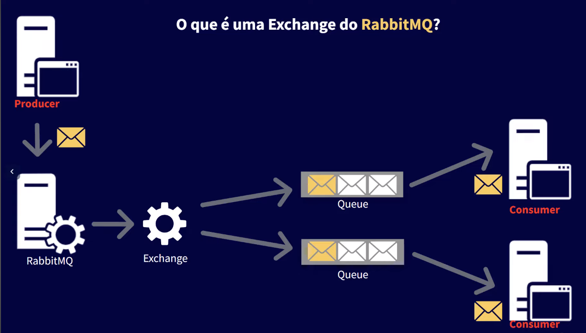
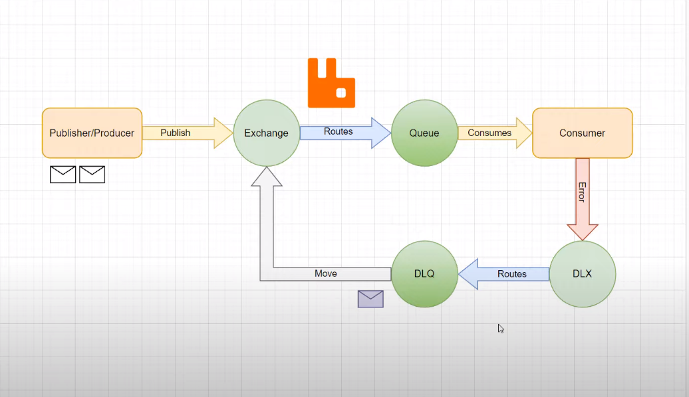

# Mensageria com Spring AMQP

**Aplicação desenvolvida no canal da Algaworks no [vídeo](https://www.youtube.com/watch?v=SzcvuHjRJKE). Uma introdução ao RabbitMQ.**

Três aplicações Spring:
- **order-service** (Api - produtor)
- **cashback-service** (backend simples - consumidor)
- **notification-service** (backend simples - consumidor)

As três aplicações irão se comunicar via mensageria. A **order-service** irá atuar como produtor e as outras aplicações serão consumidores.

**Run MySQL and RabbitMQ**
```
docker-compose up
```

**RabbitMQ Management**:
```
http://localhost:15672
user: rabbitmq
pass: rabbitmq
```

**Mensageria**





**Dead-Letter Queue**

Fila que contém mensagens que falharam no processamento. Podemos ter também uma DLX (Dead Letter Exchange) ligada a uma DLQ.

Uma vez que a mensagem vai para a DLQ podemos utilizar um plugin no rabbitmq para repor essas mensagens na fila principal para novo processamento.
Além dos plugins também podemos utilizamos o reprocessamento programaticamente. Para este último caso devemos desativar a configuração no .yml referente ao reprocessamento(retry) automático
e fazer essa configuração do retry programaticamente com um Listener para o DLQ. 

Caso o reprocessamento das mensagens ainda gerem mensagens com erro e elas não puderem ser descartadas, podemos guardá-las em um banco de dados ou enviar essas mensagens para uma outra fila. Existe um conceito chamado ParkingLot que é uma fila que contém mensagens que já passaram pelo retry (as mensagens falharam no retry)
e não podem ser descartadas.

O retry nesse exemplo foi simulado na aplicação **cashback-service**. A DeadLetterQueueListener.java trata o **retry** programaticamente e o **ParkingLot**.

